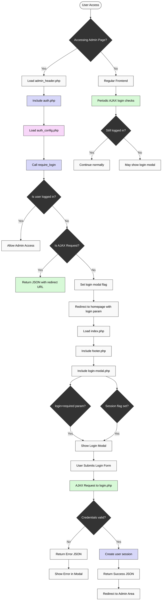

# Authentication System Architecture

The authentication system has been optimized with a centralized configuration approach. The system consists of the following components:

## File Structure

The authentication system files are organized as follows:

```
public/
├── admin/
│   ├── auth/
│   │   ├── auth_config.php     # Centralized auth configuration
│   │   ├── auth.php            # Core authentication functions
│   │   ├── check_login.php     # AJAX endpoint for checking login status
│   │   ├── login-modal.php     # Login form UI component
│   │   └── login.php           # AJAX endpoint for processing login
│   └── index.php               # Admin dashboard (requires authentication)
├── includes/
│   ├── admin_header.php        # Admin header (initiates auth check)
│   ├── footer.php              # Regular footer (includes login modal)
│   └── header.php              # Regular header (loads auth system)
├── config/
│   └── env_loader.php          # Loads environment variables
└── index.php                   # Frontend entry point
```

## Environment Variables

The following environment variables are used for authentication:

```
ADMIN_USERNAME=admin
ADMIN_PASSWORD=admin
USE_SECURE_COOKIES=true
```

In production, these values should be changed to secure credentials.

The `USE_SECURE_COOKIES` variable controls whether secure cookies are used, regardless of the HTTPS detection. Set it to `true` to always use secure cookies, or `false` to never use them. If not specified, the system will automatically detect HTTPS.

## Authentication Flow Diagram



## Key Files

- **auth_config.php**: Central configuration file containing all authentication-related constants and settings
- **auth.php**: Core authentication logic (login verification, session management, access control)
- **login.php**: AJAX endpoint for processing login requests
- **login-modal.php**: UI component for login form
- **check_login.php**: AJAX endpoint for checking current login status

## Security Measures

- **Configuration Protection**: All config files are protected from direct access
- **Session Security**: Secure session cookies with HttpOnly flag
- **Password Hashing**: Uses PHP's PASSWORD_DEFAULT algorithm
- **Anti-Caching**: Proper cache-control headers prevent authentication state caching
- **Environment Variables**: Credentials stored in environment variables outside web root

## Login Flow

1. User tries to access restricted admin page
2. `require_login()` function checks authentication
3. If not authenticated, user is redirected to login form
4. Login form submits credentials via AJAX to login.php
5. Upon successful authentication, user is redirected to intended page