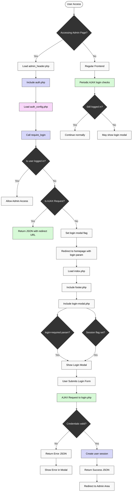

# Authentication System Architecture

The authentication system has been optimized with a centralized configuration approach. The system consists of the following components:

## File Structure

The authentication system files are organized as follows:

```
public/
├── admin/
│   ├── auth/
│   │   ├── auth_config.php     # Centralized auth configuration
│   │   ├── auth.php            # Core authentication functions
│   │   ├── check_login.php     # AJAX endpoint for checking login status
│   │   ├── login-modal.php     # Login form UI component
│   │   └── login.php           # AJAX endpoint for processing login
│   └── index.php               # Admin dashboard (requires authentication)
├── includes/
│   ├── admin_header.php        # Admin header (initiates auth check)
│   ├── footer.php              # Regular footer (includes login modal)
│   └── header.php              # Regular header (loads auth system)
├── config/
│   └── env_loader.php          # Loads environment variables
└── index.php                   # Frontend entry point
```

## Environment Variables

The following environment variables are used for authentication:

```
ADMIN_USERNAME=your_admin_username
ADMIN_PASSWORD_HASH=paste_the_generated_hash_here
USE_SECURE_COOKIES=true
```

The admin password is stored **only as a hash**. There is no cleartext form: `ADMIN_PASSWORD`
is no longer read, and a `.env` that still has it will not authenticate anybody.

Produce a hash with:

```bash
php -r 'echo password_hash("your-password", PASSWORD_DEFAULT), PHP_EOL;'
```

`PASSWORD_DEFAULT` is bcrypt, whose default cost depends on the PHP running the command —
`$2y$10$…` under 7.4, `$2y$12$…` since 8.4. Either is accepted: `password_verify()` reads
the cost from the hash itself, so generate it with whatever PHP is at hand.

`public/install.php` writes the key itself from the password typed in its form. An
installation created before this change migrates its own `.env` in place with:

```bash
php tools/hash_admin_password.php [--dry-run]
```

⚠️ **The password is not recoverable from `.env`.** Write it down: there is a single admin
account and no reset mechanism, so a lost password means editing `.env` by hand with a
freshly generated hash.

⚠️ **Never deploy with the default username** (`admin`, the fallback in `config/auth_config.php`).
An empty `ADMIN_PASSWORD_HASH` has no fallback: login simply becomes impossible, and the
login form says so instead of reporting wrong credentials.

The `USE_SECURE_COOKIES` variable controls whether secure cookies are used, regardless of the HTTPS detection. Set it to `true` to always use secure cookies, or `false` to never use them. If not specified, the system will automatically detect HTTPS.

## Changing the Admin Password

There is no form for this: the admin area manages titles, logo, language and placeholder
appearance, not credentials. Changing the password is a two-step manual procedure, and it is
deliberately kept that way — a web form would need `staff_dir_env/.env` to be writable by the
web server, and that file also holds the database credentials.

1. Generate a hash for the new password, with any PHP at hand:

   ```bash
   php -r 'echo password_hash("your-new-password", PASSWORD_DEFAULT), PHP_EOL;'
   ```

2. Paste it as the `ADMIN_PASSWORD_HASH` value in `staff_dir_env/.env`, replacing the old
   one, and upload the file if the installation is remote.

The change takes effect on the next request; no restart and no cache clearing is needed,
since `config/env_loader.php` reads `.env` on every request. Any session opened before the
change stays valid — log out to close it.

On an installation whose `.env` still holds a cleartext `ADMIN_PASSWORD` from before the
hash-only change, run `php tools/hash_admin_password.php` instead: it hashes the existing
password in place rather than setting a new one.

## Authentication Flow Diagram


```mermaid
graph TD
    A([User Access]) --> B{Accessing Admin Page?}
    B -->|Yes| C[Load admin_header.php]
    B -->|No| D[Regular Frontend]

    C --> E[Include auth.php]
    E --> F[Load auth_config.php]
    F --> G[Call require_login]
    G --> H{Is user logged in?}

    H -->|Yes| I[Allow Admin Access]
    H -->|No| J{Is AJAX Request?}
    J -->|Yes| K[Return JSON with redirect URL]
    J -->|No| L[Set login modal flag]
    L --> M[Redirect to homepage with login param]

    M --> N[Load index.php]
    N --> O[Include footer.php]
    O --> P[Include login-modal.php]
    P --> Q{login=required param?}
    P --> R{Session flag set?}

    Q -->|Yes| S[Show Login Modal]
    R -->|Yes| S

    S --> T[User Submits Login Form]
    T --> U[AJAX Request to login.php]
    U --> V{Credentials valid?}

    V -->|Yes| W[Create user session]
    V -->|No| X[Return Error JSON]
    X --> Y[Show Error in Modal]

    W --> Z[Return Success JSON]
    Z --> AA[Redirect to Admin Area]

    D --> BB[Periodic AJAX login checks]
    BB --> CC{Still logged in?}
    CC -->|Yes| DD[Continue normally]
    CC -->|No| EE[May show login modal]

    %% Improved color contrast for better readability
    classDef default fill:#f9f9f9,stroke:#333,stroke-width:1px,color:#000
    classDef config fill:#f8d7f9,stroke:#333,stroke-width:1px,color:#000
    classDef authFiles fill:#d7d7f9,stroke:#333,stroke-width:1px,color:#000
    classDef endpoints fill:#d7f9d7,stroke:#333,stroke-width:1px,color:#000
    classDef decision fill:#333,stroke:#333,stroke-width:1px,color:#fff

    class F config
    class E,G,H,V,W authFiles
    class U,BB,K endpoints
    class B,H,J,Q,R,CC,V decision
```

## Key Files

- **auth_config.php**: Central configuration file containing all authentication-related constants and settings
- **auth.php**: Core authentication logic (login verification, session management, access control)
- **login.php**: AJAX endpoint for processing login requests
- **login-modal.php**: UI component for login form
- **check_login.php**: AJAX endpoint for checking current login status

## Security Measures

- **Configuration Protection**: All config files are protected from direct access
- **Session Security**: Secure session cookies with HttpOnly flag
- **Password verification**: the submitted password is checked with `password_verify()` against `ADMIN_PASSWORD_HASH`, the only form `.env` accepts. The hash is **never** computed at include time — doing so on every request cost about 180 ms per page load and protected nothing, since a hash derived from the expected password makes `password_verify()` a string comparison in disguise. An empty hash makes every login fail, and the endpoint returns a dedicated configuration message rather than "invalid credentials", so the cause is diagnosable.
- **Anti-Caching**: Proper cache-control headers prevent authentication state caching
- **Environment Variables**: Credentials stored in environment variables outside web root

## Login Flow

1. User tries to access restricted admin page
2. `require_login()` function checks authentication
3. If not authenticated, user is redirected to login form
4. Login form submits credentials via AJAX to login.php
5. Upon successful authentication, user is redirected to intended page