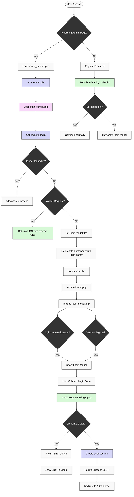

# Staff Directory Application - Development Documentation

## Version History

### Version 1.2 (March 2025)

#### March 23, 2025
*Application Branding, Database Updates, and Code Improvements*

- Implemented comprehensive application branding system
  - Added customizable application titles for both frontend and admin areas
  - Created settings to manage default and custom logos
  - Added logo upload functionality with proper validation
  - Implemented option to revert to default logo
  - Added visual preview for logo changes
- Enhanced database with software development team structure
  - Updated departments list with 12 software development-focused departments
  - Added color-coding for each department for better visual organization
  - Created comprehensive sample data with 23 staff members across all departments
  - Included international names to represent a diverse global team
  - Standardized email format with staffdirectory.com domain
  - Aligned job titles with contemporary software industry roles
- Enhanced error handling for file uploads
  - Improved user feedback for file upload errors
  - Implemented specific error messages based on PHP error codes
  - Fixed logical structure of conditional statements for error handling
- Cleaned up debug logging and code structure
  - Removed all debug logging from logo upload and removal processes
  - Corrected duplicate conditional statements
  - Enhanced maintainability by removing unnecessary code
  - Improved code organization and readability

#### March 22, 2025
*Department Color Visualization & Code Improvements*

- Added visual department color indicators throughout the application
  - Created a reusable `.pill` class in `_common.scss` for consistent styling
  - Implemented department color pills in staff management table
  - Added color pills to staff cards in the frontend directory
  - Enhanced department selection in add/edit forms with color preview
- Created a centralized `get_text_contrast_class()` function in `functions.php`
  - Determines if text should be light or dark based on background color
  - Uses standardized luminance calculation formula
  - Ensures consistent text contrast across the application
  - Replaced duplicate code with function calls for better maintainability

#### March 22, 2025
*Placeholder Image System Enhancements*

- Implemented configurable placeholder image system for staff without profile pictures
- Added admin settings page for customizing placeholder appearance
- Created settings for font weight, background color, text color, and font size
- Added font size factor control with range slider (1-6 scale)
- Converted placeholder images from PNG to WebP format for better performance
- Implemented real-time preview with JavaScript for settings adjustments
- Added automatic image regeneration when settings change
- Used settings hash to track changes and avoid unnecessary regeneration
- Migrated placeholder settings from PHP file to database storage
- Added backward compatibility for file-based settings during migration

#### March 19, 2025
*Department Management System Implementation*

#### Database Schema Improvements
- Created a proper relational database structure for departments
  - Added a new `departments` table with columns:
    - `id` (Primary Key, auto-incrementing)
    - `name` (Unique, VARCHAR)
    - `description` (TEXT)
    - `created_at` (TIMESTAMP)
    - `updated_at` (TIMESTAMP)
  - Modified the `staff_members` table to use foreign keys
    - Changed `department` text field to `department_id` integer
    - Added proper foreign key constraint with ON DELETE RESTRICT
    - Ensured data integrity between staff and departments
- Provided a comprehensive migration path
  - Created migration script (`migrate_departments.sql`)
  - Backup of existing staff data
  - Automatic extraction of departments from existing records
  - Default departments population
  - Foreign key relationship setup

#### Department Management Interface
- Implemented a full CRUD interface for department management
  - Added "Departments" navigation item to admin area
  - Created new departments.php admin page with two-panel layout:
    - Department list with actions (view, edit, delete)
    - Add/Edit form for department management
  - Implemented validation to prevent deletion of departments in use
  - Added staff count indicator to show departments in use

#### Database Architecture Changes

The database schema has been updated to support proper relational data management:

```sql
-- Departments table
CREATE TABLE `departments` (
  `id` int(11) NOT NULL AUTO_INCREMENT,
  `name` varchar(100) NOT NULL,
  `description` text,
  `created_at` timestamp NOT NULL DEFAULT CURRENT_TIMESTAMP,
  `updated_at` timestamp NOT NULL DEFAULT CURRENT_TIMESTAMP ON UPDATE CURRENT_TIMESTAMP,
  PRIMARY KEY (`id`),
  UNIQUE KEY `name` (`name`)
) ENGINE=InnoDB DEFAULT CHARSET=utf8mb4;

-- Modified staff_members table
ALTER TABLE `staff_members`
  ADD COLUMN `department_id` int(11) NOT NULL AFTER `last_name`,
  ADD KEY `department_id` (`department_id`),
  ADD CONSTRAINT `staff_members_ibfk_1`
  FOREIGN KEY (`department_id`) REFERENCES `departments` (`id`)
  ON DELETE RESTRICT ON UPDATE CASCADE;
```

##### Default Departments

The system is pre-configured with the following departments:
- IT (Information Technology)
- Marketing
- HR (Human Resources)
- Finance
- Operations

#### Application Code Updates

- Updated admin interface to use department dropdowns
  - Modified add.php and edit.php forms to use select elements
  - Changed SQL queries to reference department_id instead of department name
  - Updated parameter binding from string (`s`) to integer (`i`) for department_id
- Added new helper functions in functions.php:
  - `get_all_departments()` - Returns complete department records
  - `get_all_department_names()` - Returns only department names for dropdowns
  - `get_department_by_id()` - Retrieves a department by ID
  - `get_department_by_name()` - Retrieves a department by name
- Updated existing functions to work with the new structure
  - Modified `get_all_staff_members()` to JOIN with the departments table
  - Updated `get_staff_member_by_id()` to include department information

### Version 1.1 - March 18, 2025
*Authentication System Optimization & Environment Configuration*

#### Authentication System Improvements
- Centralized authentication configuration
  - Created `auth_config.php` to consolidate all auth-related settings
  - Standardized session and cookie parameters across the application
  - Improved maintainability and security with centralized constants
  - Protected configuration file from direct access
- Added environment variable control for secure cookies
  - Created `USE_SECURE_COOKIES` environment variable
  - Implemented fallback to auto-detect HTTPS when not explicitly set
  - Added proper documentation for configuration options
- Enhanced authentication architecture
  - Created comprehensive authentication flow diagram
  - Documented file structure and responsibilities
  - Improved code organization and readability

#### Authentication System Architecture

The authentication system has been optimized with a centralized configuration approach. The system consists of the following components:

##### File Structure

The authentication system files are organized as follows:

```
public/
├── admin/
│   ├── auth/
│   │   ├── auth_config.php     # Centralized auth configuration
│   │   ├── auth.php            # Core authentication functions
│   │   ├── check_login.php     # AJAX endpoint for checking login status
│   │   ├── login-modal.php     # Login form UI component
│   │   └── login.php           # AJAX endpoint for processing login
│   └── index.php               # Admin dashboard (requires authentication)
├── includes/
│   ├── admin_header.php        # Admin header (initiates auth check)
│   ├── footer.php              # Regular footer (includes login modal)
│   └── header.php              # Regular header (loads auth system)
├── config/
│   └── env_loader.php          # Loads environment variables
└── index.php                   # Frontend entry point
```

##### Environment Variables

The following environment variables are used for authentication:

```
ADMIN_USERNAME=admin
ADMIN_PASSWORD=admin
USE_SECURE_COOKIES=true
```

In production, these values should be changed to secure credentials.

The `USE_SECURE_COOKIES` variable controls whether secure cookies are used, regardless of the HTTPS detection. Set it to `true` to always use secure cookies, or `false` to never use them. If not specified, the system will automatically detect HTTPS.

##### Authentication Flow Diagram



##### Key Files

- **auth_config.php**: Central configuration file containing all authentication-related constants and settings
- **auth.php**: Core authentication logic (login verification, session management, access control)
- **login.php**: AJAX endpoint for processing login requests
- **login-modal.php**: UI component for login form
- **check_login.php**: AJAX endpoint for checking current login status

##### Security Measures

- **Configuration Protection**: All config files are protected from direct access
- **Session Security**: Secure session cookies with HttpOnly flag
- **Password Hashing**: Uses PHP's PASSWORD_DEFAULT algorithm
- **Anti-Caching**: Proper cache-control headers prevent authentication state caching
- **Environment Variables**: Credentials stored in environment variables outside web root

##### Login Flow

1. User tries to access restricted admin page
2. `require_login()` function checks authentication
3. If not authenticated, user is redirected to login form
4. Login form submits credentials via AJAX to login.php
5. Upon successful authentication, user is redirected to intended page

### Version 1.0 - March 16-17, 2025
*Initial Release*

#### Directory Structure Reorganization
- Restructured application to follow security best practices
- Created a separate `public` directory to serve as the web root
- Moved all web-accessible files to the public directory
- Kept sensitive files and code outside the publicly accessible area
- Moved the `env` directory to the project root for easier access while maintaining security
- Updated all file paths and includes to reflect the new structure
- Modified the README with comprehensive directory structure documentation

#### Authentication System Initial Implementation
- Fixed authentication system to work with the new directory structure
  - Improved error handling in JSON API endpoints
  - Enhanced session management and persistence
  - Used output buffering to prevent unwanted output
  - Ensured consistent session initialization across the application
- Implemented robust login state persistence
  - Added proper cache control headers to prevent stale login information
  - Improved cookie handling for better session persistence
  - Fixed session cookie parameters for domain-wide availability
  - Enhanced error handling for network requests
- Fixed .htaccess configuration to avoid server errors
  - Removed invalid directives that were causing 500 errors
  - Updated security settings for proper directory access

#### Security Improvements
- Removed hardcoded credentials from codebase using environment variables
- Created external `.env` file located outside the web root for better security
- Implemented a custom environment loader in `config/env_loader.php`
- Updated database configuration and authentication system to use environment variables
- Added proper documentation in README for environment setup
- Created `.gitignore` file to prevent accidental commit of sensitive files
- Fixed SQL injection vulnerabilities by replacing string concatenation with prepared statements
  - Added parameter binding for all database queries
  - Implemented input validation for sort fields and sort order
  - Properly parameterized LIKE clauses for search functionality

#### Login Modal Enhancements
- Fixed login modal functionality to properly handle user authentication
- Resolved issues with modal positioning by updating SCSS for perfect centering
- Added a login status check endpoint (`check_login.php`) to determine if user is already authenticated
- Updated form submission to use AJAX instead of traditional form submission
- Improved error handling with clear error messages for failed login attempts
- Enhanced user experience by redirecting directly to admin dashboard when already logged in
- Updated modal structure to properly follow the SCSS component architecture
- Added proper error display within the modal body

#### Image Removal Feature
- Added a remove button (cross icon) to the image preview on both add.php and edit.php forms
- Implemented JavaScript functionality to handle image removal:
  - When clicked on add.php: Resets to placeholder image
  - When clicked on edit.php: Marks the image for deletion upon form submission
- Added hidden form field (`delete_image`) to track image deletion requests
- Updated PHP to handle image deletion from both filesystem and database
- Enhanced styling with improved positioning and visual feedback
- Ensured proper cleanup of file inputs and image preview elements
- Fixed edge cases for various image states (new uploads, existing images)

#### Profile Picture Implementation
- Replaced static default avatar with dynamic placeholder images
- Implemented [placehold.co](https://placehold.co/) service for generating placeholder images
- Used staff member initials (first letter of first name + first letter of last name) for personalized placeholders
- Different placeholder image sizes based on context:
  - Frontend cards: 600x400 with initials
  - Admin list: 50x50 with initials
  - Edit/Add forms: 200x200 with initials or "NEW" for add form
- Added robust file existence verification to prevent broken image links
- Created centralized `get_staff_image_url()` function to handle all image URL generation
- Added admin console warnings for missing profile images with detailed information

#### SCSS Implementation
- Restructured CSS into SCSS format for better maintainability
- Created modular SCSS structure with separate files:
  - `_variables.scss`: Contains color variables, breakpoints, and reusable mixins
  - `_common.scss`: Shared styles used in both frontend and admin interfaces
  - `frontend.scss`: Frontend-specific styles for staff directory display
  - `admin.scss`: Admin-specific styles for the dashboard and management interface
  - `main.scss`: Main import file showing dependency structure
- Implemented SCSS best practices:
  - Used variables for consistent colors and spacing
  - Created mixins for repeated patterns like flexbox layouts
  - Used nesting for cleaner, more readable code
  - Separated concerns into logical partials
  - Added responsive breakpoint mixins
- Updated header files to reference the appropriate compiled CSS files

#### LineIcons Integration
- Added the LineIcons icon library via npm
- Copied icon files to assets/vendor/lineicons directory
- Added CSS include to both frontend and admin header files
- LineIcons usage example: `<i class="lni lni-search"></i>` for a search icon

#### Drag & Drop Image Uploads
- Implemented native JavaScript drag and drop functionality for profile pictures
- Created a modern dropzone UI with visual feedback for drag events
- Enhanced the image preview functionality to work with both drag & drop and file input
- Improved the user experience when uploading staff profile images
- Used LineIcons for the upload icon interface

#### Additional Code Updates
- Updated `functions.php` to handle empty profile picture strings and added new functionality
- Enhanced admin dashboard with console warnings for missing images
- Added additional security headers and best practices through `.htaccess`
- Standardized code styling and formatting throughout the application

#### Placeholder Image System
- Implemented a configurable placeholder image system for staff without profile pictures
- Created an admin settings page to customize placeholder appearance
- Added settings for font weight, background color, text color, and font size
- Converted placeholder images from PNG to WebP format for better performance
- Implemented automatic image regeneration when settings change
- Used settings hash to track changes and avoid unnecessary regeneration
- Optimized font sizing algorithm based on image dimensions


## Environment Configuration
- PHP 7.4
- MySQL database (Connection name: `staff_dir`)
- Frontend UI using HTML/SCSS/Vanilla JavaScript
- LineIcons v2.0 for icon library (installed via npm)
- Local image storage in `uploads` directory
- Custom authentication system for admin area (previously was `.htaccess`/`.htpasswd`)
- Development URL: https://staffdirectory.local (configured via local hosts file)


## Project Roadmap

### Completed Features
- ✅ LineIcons library integration (March 16, 2025)
- ✅ Admin dashboard UI improvements with icons and buttons (March 16, 2025)
- ✅ Drag-and-drop image upload functionality (March 16, 2025)
- ✅ Centralized authentication configuration (March 18, 2025)
- ✅ Environment variable support for secure cookies (March 18, 2025)
- ✅ Authentication flow documentation and visualization (March 18, 2025)
- ✅ Enhanced placeholder image generation (March 22, 2025)
  - Added configurable font size factor setting
  - Converted placeholder images from PNG to WebP format
  - Improved image quality and reduced file sizes
- ✅ Fixed image handling for user profiles (March 22, 2025)
  - Fixed remove button visibility for placeholder images
  - Added real-time placeholder image updates when selecting departments
  - Improved name initial detection for placeholder images
  - Fixed user creation issues with empty profile pictures
- ✅ Enhanced placeholder image settings UI (March 22, 2025)
  - Added real-time preview for font weight and font size changes
  - Improved browser cache handling for placeholder image previews
  - Fixed font size slider update issues
  - Streamlined settings interface by removing redundant information
- ✅ Application branding system implementation (March 23, 2025)
  - Added customizable application titles for frontend and admin areas
  - Implemented custom logo upload and management
  - Added logo preview functionality with real-time updates
  - Created option to revert to default logo when needed
  - Improved error handling for file uploads
- ✅ Database enhancement for software development teams (March 23, 2025)
  - Updated departments list with 12 software development-focused departments
  - Added color-coding for each department for better visual categorization
  - Created comprehensive sample data with 23 staff members across all departments
  - Included international names to represent a diverse global team
  - Standardized email format with staffdirectory.com domain
  - Aligned job titles with contemporary software industry roles

### Planned Improvements

#### Version 1.2 (Planned)
- ~~Create a Git repository for version control~~
- ~~Department management section (Database table and admin interface)~~
- ~~Create a default logo for the App~~
- ~~Create a setting panel in the admin to set a custom logo instead of the default logo and modify associated titles for front-end and admin~~
- ~~Improve Placeholder Image Settings to set a real live preview of the update (Javascript)~~
- ~~Updated database with comprehensive software development departments and staff members~~
- ~~Create default user images to match the default application setup and alternate between users that have and don't have profile pictures to display examples of placeholder images~~
- Improve unused placeholder images management to remove them when not needed either by programming a folder cleanup once a day and/or by using temporary images when editing settings or creating/editing users
- Improve UX/UI design for admin and Front-end using TailAdmin
- Replace LineIcons by TailAdmin's icon set
- Add internationalization support (FR/EN translation files)

#### Version 1.3 (Planned)
- Enable login possibility to access the front-end
- Add advanced search features for Staff Members Management
- CSV import/export functionality
- Enhanced authentication security:
  - CSRF protection for login form
  - Login rate limiting
  - Remember-me functionality
  - Additional session security parameters
  - Class-based authentication architecture
